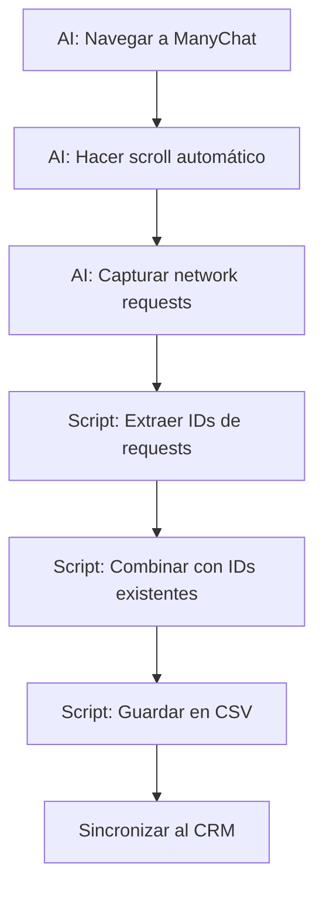

# Extracción de Subscriber IDs con Browser MCP

Este script extrae subscriber IDs de **todas las plataformas** (Facebook, Instagram y WhatsApp) desde ManyChat usando el browser MCP de Cursor.

## 🎯 ¿Qué hace este script?

1. **Navega a ManyChat** usando el browser MCP
2. **Intercepta las network requests** para capturar subscriber IDs
3. **Hace scroll automático** para cargar más contactos
4. **Extrae IDs** de todas las plataformas:
   - Facebook (psid en URLs de imágenes)
   - Instagram (subscriber IDs en API)
   - WhatsApp (IDs en respuestas API)
5. **Guarda los IDs** en `scripts/subscriber-ids-extracted.csv`
6. **Combina con IDs existentes** (no duplica)

## 📋 Patrones de Extracción

El script busca IDs en múltiples formatos:

### Patrón 1: Facebook Profile Pictures
```
https://platform-lookaside.fbsbx.com/platform/profilepic/?psid=32640609408919422
```

### Patrón 2: API Subscribers
```
https://api.manychat.com/subscribers/25541058665519003
```

### Patrón 3: Query Parameters
```
?id=32456203903994641
?subscriber_id=25664781093127386
?contact_id=24468252062848178
```

### Patrón 4: JSON Responses
```json
{
  "id": "25541058665519003",
  "subscribers": [
    {"subscriber_id": "32640609408919422"}
  ]
}
```

## 🚀 Uso con Browser MCP

Este script está diseñado para ser ejecutado por el AI con browser MCP. El AI ejecutará automáticamente estos pasos:

### Paso 1: Navegar a ManyChat
```javascript
await browser_navigate("https://manychat.com/contacts")
```

### Paso 2: Esperar a que cargue
```javascript
await browser_snapshot() // Verificar que cargó
```

### Paso 3: Hacer scroll automático
```javascript
// Scroll hasta el final para cargar todos los contactos
for (let i = 0; i < 10; i++) {
  await browser_press_key("End")
  await browser_wait_for({ time: 2 }) // Esperar 2 segundos
}
```

### Paso 4: Capturar network requests
```javascript
const networkRequests = await browser_network_requests()
```

### Paso 5: Procesar con este script
```javascript
const { processNetworkData } = require('./scripts/extract-subscriber-ids-browser-mcp.js')
const result = processNetworkData(networkRequests)
```

## 📦 Resultado

El script genera/actualiza el archivo:

```
scripts/subscriber-ids-extracted.csv
```

Formato:
```csv
pageuid
1766949726
1767089711
25541058665519003
32640609408919422
...
```

## 🔄 Flujo Completo



## 🎨 Features

✅ **Extracción automática** de IDs desde network requests  
✅ **Scroll automático** para cargar todos los contactos  
✅ **Multi-plataforma**: Facebook, Instagram, WhatsApp  
✅ **Sin duplicados**: Combina con IDs existentes  
✅ **Formato CSV** listo para sincronizar  
✅ **Logging detallado** con colores  
✅ **Robusto**: Múltiples patrones de extracción

## 📊 Estadísticas

El script muestra:
- Total de IDs únicos
- IDs nuevos agregados
- IDs existentes (del CSV anterior)
- Primeros 10 IDs encontrados

Ejemplo de salida:

```
============================================================
Resumen de Extracción
============================================================
✓ Total de IDs únicos: 245
✓ IDs nuevos agregados: 18

Primeros 10 IDs:
  1. 1766949726
  2. 1767089711
  3. 24468252062848178
  4. 24586673454339326
  ...y 235 más

============================================================
Próximos Pasos
============================================================
ℹ Para sincronizar estos IDs al CRM, ejecuta:
ℹ node scripts/sync-manychat-by-ids.js
ℹ 
ℹ O desde npm:
ℹ npm run manychat:sync-by-ids
```

## 🔧 Uso Manual (Opcional)

Si tienes un archivo JSON con las network requests guardado:

```bash
node scripts/extract-subscriber-ids-browser-mcp.js network-requests.json
```

## 🎯 Próximos Pasos

Después de extraer los IDs:

### 1. Sincronizar al CRM
```bash
npm run manychat:sync-by-ids
```

Este comando:
- Lee el CSV generado
- Obtiene los datos de cada subscriber desde la API de ManyChat
- Los sincroniza al CRM de Supabase

### 2. Sincronizar etiquetas
```bash
npm run manychat:sync-tags
```

### 3. Verificar en el CRM
Revisa que los contactos se hayan importado correctamente en tu CRM.

## 🔍 Troubleshooting

### No se encontraron IDs

**Posibles causas:**
- No hubo network requests capturadas
- ManyChat no cargó correctamente
- No hay contactos en la cuenta
- Cloudflare bloqueó el acceso

**Solución:**
1. Verifica que ManyChat cargó correctamente
2. Asegúrate de haber hecho scroll para cargar contactos
3. Espera más tiempo entre scrolls
4. Intenta manualmente con el navegador visible

### IDs duplicados

El script **automáticamente** elimina duplicados combinando con el CSV existente. No es necesario hacer nada.

### Formato de IDs

Los IDs válidos tienen:
- Entre 15 y 20 dígitos
- Solo números
- Sin espacios ni caracteres especiales

Ejemplos válidos:
- ✅ `32640609408919422` (17 dígitos)
- ✅ `25541058665519003` (17 dígitos)
- ✅ `1766949726` (10 dígitos - IDs más antiguos)
- ❌ `abc123` (no es solo números)
- ❌ `123` (muy corto)

## 🔐 Seguridad

- ✅ No requiere credenciales de ManyChat (usa sesión del navegador)
- ✅ No modifica datos en ManyChat
- ✅ Solo lectura de network requests
- ✅ No se comparten datos fuera del sistema

## 🎓 Ventajas vs Otros Métodos

| Método | Ventajas | Desventajas |
|--------|----------|-------------|
| **Browser MCP** (Este) | ✅ Automático<br>✅ Todos los IDs<br>✅ Sin Playwright | ⚠️ Requiere AI<br>⚠️ Sesión activa |
| **Playwright Scraping** | ✅ Automático<br>✅ Control total | ❌ Lento<br>❌ Requiere setup |
| **Exportación Manual** | ✅ Más confiable<br>✅ Oficial | ❌ Manual<br>❌ Por etiquetas |
| **API de ManyChat** | ✅ Rápido<br>✅ Oficial | ❌ No lista todos<br>❌ Solo get by ID |

## 📚 Documentación Relacionada

- [Sincronizar IDs al CRM](./README-sync-by-tags.md)
- [Scraping con Playwright](./README-scrape-contacts.md)
- [Importar desde CSV](./README-import-csv.md)
- [Sincronizar Etiquetas](./README-sync-tags.md)

## 💡 Tips

1. **Máximo de contactos**: Haz scroll varias veces para cargar todos
2. **Velocidad**: No hagas scroll muy rápido, da tiempo a cargar
3. **Verificación**: Revisa el CSV después de cada extracción
4. **Incremental**: El script combina con IDs anteriores, puedes ejecutarlo varias veces
5. **Backup**: Guarda copias del CSV antes de sincronizar

## 🤝 Contribuir

Si encuentras más patrones de IDs en las network requests, agrégalos al script:

```javascript
// Nuevo patrón
const newPatternMatch = url.match(/\/nuevo-patron\/(\d{15,})/i)
if (newPatternMatch) {
  subscriberIds.add(newPatternMatch[1])
}
```

## 📞 Soporte

Si tienes problemas:
1. Revisa el CSV generado
2. Verifica que las network requests se capturaron
3. Intenta hacer más scroll para cargar más contactos
4. Revisa que ManyChat esté cargado correctamente


